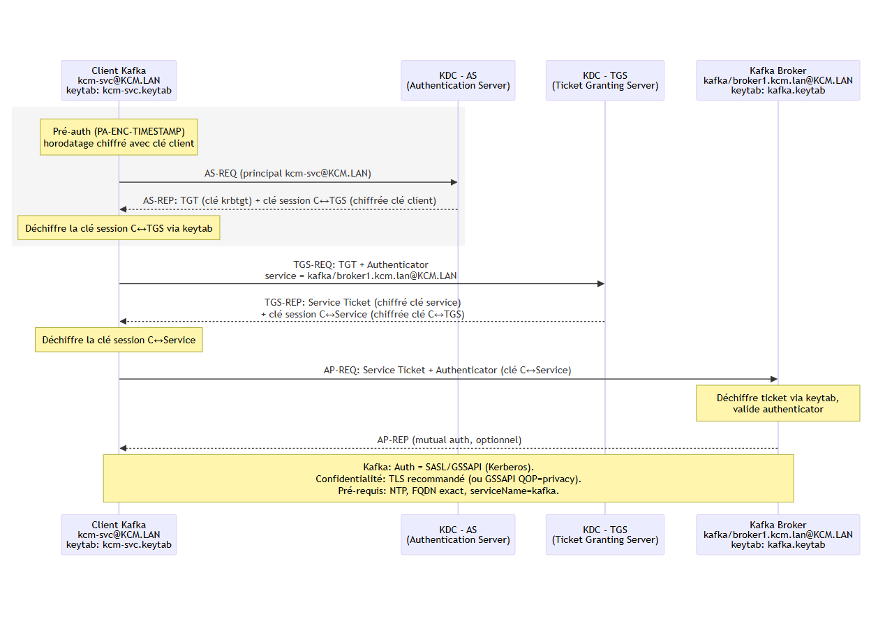

# 🔐 Kafka + Kerberos (GSSAPI) — Client / Broker / KDC Interactions

This document summarizes how **Kerberos (GSSAPI)** authentication works in a Kafka cluster.

---

## 📌 Kerberos Basics

* A **principal** identifies a user or a service. Example:

    * User: `alice@EXAMPLE.COM`
    * Service: `kafka/broker1.example.com@EXAMPLE.COM`
* A **Key Distribution Center (KDC)** manages authentication. It is composed of:

    * **AS (Authentication Service)**: the entry point, it authenticates the client’s identity and issues a **Ticket Granting Ticket (TGT)**.
    * **TGS (Ticket Granting Service)**: uses the TGT to issue **Service Tickets** for specific services (e.g., Kafka brokers).
    * **Database**: stores principals and their secret keys.
* A **keytab** is a file containing pairs of principals and their encrypted keys. Services use keytabs to authenticate without human intervention.
* **Realms** define the administrative domain for Kerberos. They are usually uppercase versions of the domain name (e.g., `EXAMPLE.COM`).

➡️ **Think of it this way:**

* **AS** = "passport office" → proves your identity and gives you a passport (TGT).
* **TGS** = "visa office" → takes your passport and gives you a visa (Service Ticket) for the service you want to access.
* **Keytab** = "pre-approved ID card" → lets services prove who they are without needing a password.
* **Realm** = "country" → the jurisdiction where your identity is recognized.
* **Ticket** = "visa" → allows access to a specific service for a limited time.
* **TGT** = "passport" → allows you to get visas for various services without re-proving your identity each time.
* **KDC** = "government agency" → the authority that issues passports and visas.
* **Client** = "user or application" → the entity trying to access a service. 
* **Service** = "server or application" → the entity providing a service that requires authentication.

---

## 🏢 Common Kerberos Implementations

These are the most widely used Kerberos servers in enterprises:

* **Microsoft Active Directory (AD)** → The most common in corporate environments, integrates Kerberos with LDAP and Windows domain management.
* **MIT Kerberos** → The reference implementation, widely used in Linux/Unix environments.
* **Heimdal Kerberos** → An alternative implementation, often found in BSD systems.
* **Red Hat Identity Management (FreeIPA)** → Provides Kerberos + LDAP + certificate management.
* **Apache Directory with Kerberos support** → Java-based directory server with Kerberos capabilities (less common).

---

## 💻 Example principal in Active Directory (AD)

* In Windows AD, service principals are registered as **Service Principal Names (SPN)**.
* Example for a Kafka broker:

  ```
  kafka/broker1.corp.local@CORP.LOCAL
  ```
* This SPN is mapped to an AD account (usually a dedicated service account).
* The broker retrieves its key from the AD-generated keytab (or via `ktpass`).

---

## 🔑 Generating a keytab with Active Directory

* In Windows AD, you can use the `ktpass` tool to generate a keytab for the service account.
* Example:

  ```powershell
  ktpass -princ kafka/broker1.corp.local@CORP.LOCAL \
         -mapuser kafka-svc@corp.local \
         -pass * \
         -ptype KRB5_NT_PRINCIPAL \
         -crypto AES256-SHA1 \
         -out kafka-broker1.keytab
  ```
* This keytab is then copied securely to the Kafka broker machine.

---

## 🔑 Generating a keytab with MIT Kerberos (Linux KDC)

* On a MIT Kerberos server, you use `kadmin.local` to create principals and export keytabs.
* Example:

  ```bash
  # Create a broker principal
  kadmin.local -q "addprinc -randkey kafka/broker1.example.com@EXAMPLE.COM"

  # Create a client principal for testing
  kadmin.local -q "addprinc -randkey alice@EXAMPLE.COM"

  # Export the broker keytab
  kadmin.local -q "ktadd -k /etc/security/keytabs/kafka-broker1.keytab kafka/broker1.example.com@EXAMPLE.COM"

  # Export the client keytab (optional)
  kadmin.local -q "ktadd -k /etc/security/keytabs/alice.keytab alice@EXAMPLE.COM"
  ```
* The broker’s keytab is deployed on the Kafka node, while the client’s keytab can be used for testing authentication.

---

## 🔄 Kafka + Kerberos Authentication Flow

### 1. Initial client authentication

* The Kafka client (producer/consumer/admin) starts and needs to authenticate.
* It uses its key (keytab) or Kerberos password to request a **TGT** from the **AS** (AS-REQ).
* The **AS** checks the identity and returns a **TGT** (AS-REP).

➡️ The client is now authenticated in the Kerberos realm.

---

### 2. Connecting to the Kafka broker (bootstrap)

* The client opens a SASL/GSSAPI connection to a **bootstrap broker** defined in `bootstrap.servers`.
* The Kafka client library uses the **service name** (`kafka`) + the **broker FQDN** to build the expected SPN:

  ```
  kafka/broker1.example.com@EXAMPLE.COM
  ```
* The client sends a **TGS-REQ** to the **TGS** using its TGT, asking for a ticket for that SPN.
* The TGS returns a **Service Ticket** encrypted with the broker’s secret key (from its keytab).

➡️ The client sends this ticket to the broker.
➡️ The broker decrypts it and validates the client identity.

---

### 3. Discovering other brokers

* Once authenticated, the client sends a `MetadataRequest` to the bootstrap broker.
* The broker returns the **full list of cluster brokers** with their **FQDNs**.
* For each new connection (e.g. to `broker2.example.com`), the client repeats step 2 with the correct SPN:

  ```
  kafka/broker2.example.com@EXAMPLE.COM
  ```

➡️ Each broker has its own principal and its own ticket.

---

## ✅ Key points to remember

1. **Always use FQDNs** (never IPs) in:

    * `bootstrap.servers`
    * `advertised.listeners`
    * Kerberos principals

2. Each broker must have its own Kerberos principal and keytab:

   ```
   kafka/broker1.example.com@REALM
   kafka/broker2.example.com@REALM
   kafka/broker3.example.com@REALM
   ```

3. The client automatically requests a **Service Ticket per broker** when it opens a new connection.

4. **SASL_PLAINTEXT vs SASL_SSL**:

    * SASL_PLAINTEXT = Kerberos authentication, but unencrypted Kafka traffic.
    * SASL_SSL = Kerberos authentication + TLS encryption of Kafka traffic.

---

## 🖼️ Simplified diagram



---

## 🚨 Common errors

* Using **IP addresses** instead of FQDNs (ticket mismatch).
* Keytab not mounted or missing principal.
* `sasl.kerberos.service.name` ≠ `kafka` on the client.
* Realm misconfigured in `krb5.conf` / `krb5.ini`.
